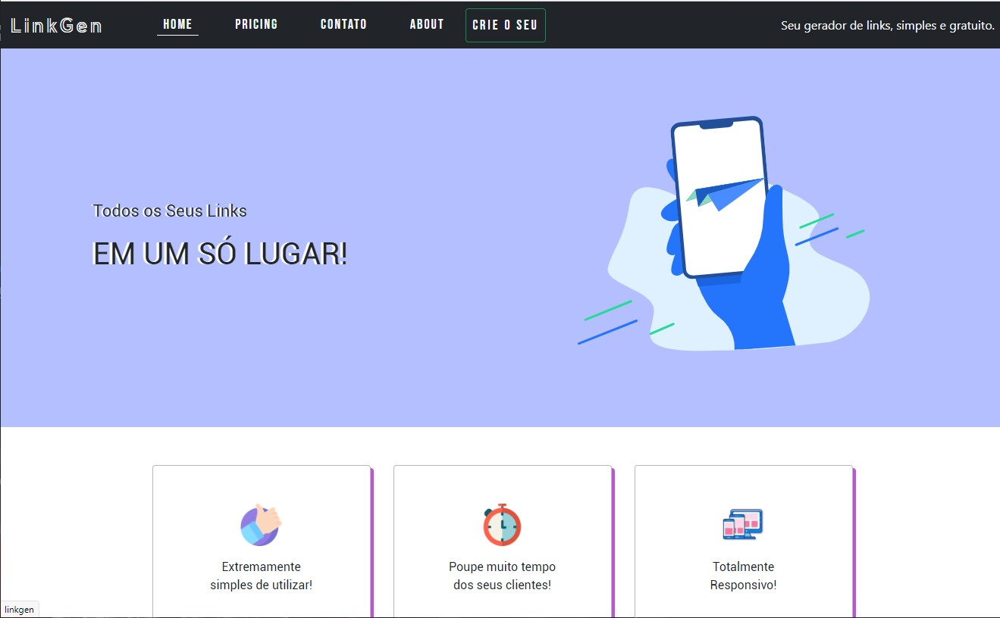

# LinkGen - Caso de estudo

## Descrição do projeto:

<h1 align="center">
  
</h1>

Este site foi feito para estudos em sala de Aula da máteria Frameworks - PHP do curso de Análise e Desenvolvimento de Sistemas da FASM  
Foi usado como base um "Mini Framework" construido em sala. O desafio era montar todo o frontend com tema livre usando como base esse framework desenvolvido.
